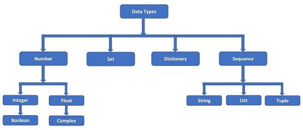

# Basic instructions 




- Numbers in the python

```python
# Hello World in Python
name = "Ameer"
age = 25
is_student = True

print("Hello,", name)
print("Age:", age)
print("Student:", is_student)
```

| Name   | Age | Role     |
|--------|-----|----------|
| Alice  | 24  | Developer|
| Bob    | 30  | Designer |


- Strings in the Python
  - items list
  - [OpenAI](https://openai.com "Visit OpenAI")


